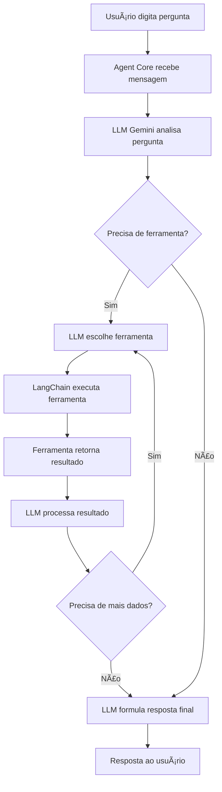

# Como o Agente se Comunica com as Ferramentas

## 🯠Visão Geral

O agente usa o padrão **ReAct (Reasoning + Acting)** do LangChain para raciocinar sobre problemas e executar ferramentas de forma inteligente.

```
Usuário → Pergunta → LLM (Gemini) → Raciocínio → Ferramenta → Resultado → LLM → Resposta
```

## 📊 Arquitetura de Comunicação

### 1. Fluxo Completo



### 2. Componentes da Comunicação

#### **Agent Core** (`src/agent/agent_core.py`)

```python
class FiscalDocumentAgent:
    def __init__(self, api_key: str, model_name: str):
        # 1. Inicializa LLM (Gemini)
        self.llm = ChatGoogleGenerativeAI(model=model_name, ...)

        # 2. Inicializa memória (histórico da conversa)
        self.memory = ConversationBufferMemory(...)

        # 3. Carrega ferramentas (tools)
        # 4. Cria prompt template (instruções)
        # 5. Cria executor (orquestrador)
        self.executor = AgentExecutor(
            agent=self.agent,
            tools=ALL_TOOLS,  # ↠Aqui estão as ferramentas!
            memory=self.memory,
            max_iterations=5,  # Máximo de tentativas
        )

    def chat(self, message: str) -> str:
        # Usuário envia mensagem
        response = self.executor.invoke({"input": message})
        return response.get("output")
```

#### **Ferramentas Disponíveis** (`src/agent/tools.py`)

```python
ALL_TOOLS = [
    parse_xml_tool,              # Parsear XMLs fiscais
    validate_invoice_tool,       # Validar documentos
    database_search_tool,        # Buscar no banco ↠PRINCIPAL!
    database_stats_tool,         # Estatísticas gerais
    fiscal_knowledge_tool,       # Conhecimento fiscal geral
]
```

#### **Prompt System** (`src/agent/prompts.py`)

```python
SYSTEM_PROMPT = """
Você é um assistente especializado em documentos fiscais.

FERRAMENTAS DISPONÃVEIS:
- search_invoices_database: Para buscar documentos salvos
- get_database_statistics: Para estatísticas gerais
...

QUANDO O USUÃRIO PERGUNTAR SOBRE HISTÓRICO:
1. Use search_invoices_database
2. Filtre por tipo de operação, emitente, período
3. Apresente resultados organizados
"""
```

## 🔧 Como Funciona a Comunicação (Passo a Passo)

### Exemplo Real: "Quantas notas de compra temos?"

#### **Passo 1:** Usuário pergunta

```
Usuário: "Quantas notas de compra temos no ano de 2024?"
```

#### **Passo 2:** Agent Core recebe

```python
# src/agent/agent_core.py
def chat(self, message: str) -> str:
    response = self.executor.invoke({"input": message})
    #                                   ↑
    #                         Pergunta do usuário
```

#### **Passo 3:** LLM (Gemini) raciocina

```
Thought: O usuário quer saber quantas notas de COMPRA existem em 2024.
         Preciso usar a ferramenta search_invoices_database com:
         - operation_type='purchase'
         - Período de 2024
```

#### **Passo 4:** LLM escolhe ferramenta

```
Action: search_invoices_database
Action Input: {"operation_type": "purchase", "days_back": 9999}
```

#### **Passo 5:** LangChain executa ferramenta

```python
# src/agent/tools.py - DatabaseSearchTool
def _run(self, operation_type='purchase', days_back=9999):
    # 🚨 HARDCODED: Auto-força days_back=9999
    if operation_type is not None:
        days_back = 9999  # ↠Garantia!

    db = DatabaseManager()
    invoices = db.search_invoices(
        operation_type=operation_type,
        days_back=days_back,
    )

    # Formata resultado
    return """
    📊 Encontrados 2 documento(s):

    Por Tipo de Operação:
    - 📥 Compras: 2

    📥 NFe - 3510129/1 | Compra
       🢠Emitente: COMPANHIA BRASILEIRA...
       📅 Data: 18/01/2024
       💰 Valor: R$ 522.50
    ...
    """
```

#### **Passo 6:** LLM processa resultado

```
Observation: Encontrados 2 documentos de compra em 2024, totalizando R$ 1,522.50
```

#### **Passo 7:** LLM formula resposta final

```
Thought: Agora tenho todas as informações necessárias.
Final Answer: 📊 Temos 2 notas de compra no ano de 2024!

💰 Valor total: R$ 1,522.50

📥 Documentos encontrados:
1. NFe 3510129/1 - COMPANHIA BRASILEIRA... - R$ 522.50 (18/01/2024)
2. NFe 1/1 - FORNECEDOR TESTE LTDA - R$ 1,000.00 (15/01/2024)
```

#### **Passo 8:** Resposta ao usuário

```
Streamlit exibe a resposta formatada em markdown
```

## ğŸ› ï¸ Anatomia de uma Ferramenta (Tool)

### Estrutura Base

```python
from langchain.tools import BaseTool
from pydantic import BaseModel, Field

# 1. Define o schema de entrada
class SearchInvoicesInput(BaseModel):
    """Schema for search inputs."""

    operation_type: Optional[str] = Field(
        None,
        description="Purchase, Sale, Transfer, or Return"
    )
    days_back: int = Field(
        3650,
        description="Default is 3650 (10 years)"
    )

# 2. Cria a ferramenta
class DatabaseSearchTool(BaseTool):
    """Tool for searching invoices."""

    name: str = "search_invoices_database"
    description: str = """
    🚨 INSTRUÇÕES PARA O LLM:
    - Para contar documentos → use days_back=9999
    - Para "notas de compra" → operation_type='purchase'
    - Para ano específico → days_back=9999
    """
    args_schema: type[BaseModel] = SearchInvoicesInput

    def _run(self, operation_type=None, days_back=3650) -> str:
        """Execute search."""
        # Lógica da ferramenta
        db = DatabaseManager()
        results = db.search_invoices(...)
        return formatted_results

    async def _arun(self, ...) -> str:
        """Async version."""
        return self._run(...)
```

### Elementos Críticos

1. **`name`**: Nome único que o LLM usa para chamar a ferramenta
2. **`description`**: Instruções claras para o LLM saber QUANDO e COMO usar
3. **`args_schema`**: Schema Pydantic que valida os parâmetros
4. **`_run()`**: Lógica de execução (obrigatório)
5. **`_arun()`**: Versão assíncrona (opcional, mas recomendado)

## 📠Melhores Práticas para Ferramentas

### ✅ DO: Instruções Claras na Description

```python
description: str = """
Search for fiscal documents with filters.

🚨 CRITICAL RULES (YOU MUST FOLLOW):
1. For "quantas", "how many" → ALWAYS use days_back=9999
2. For "compra", "purchase" → operation_type='purchase'
3. For specific year (2024) → days_back=9999

✅ CORRECT EXAMPLES:
- "Quantas notas de compra?" → operation_type='purchase', days_back=9999
- "Compras de 2024?" → operation_type='purchase', days_back=9999

OPERATION TYPE MAPPING:
- "compra", "purchase", "entrada" → 'purchase'
- "venda", "sale", "saída" → 'sale'
"""
```

**Por quê?** O LLM lê a `description` para decidir se deve usar a ferramenta e quais parâmetros passar.

### ✅ DO: Validação de Entrada com Pydantic

```python
class SearchInput(BaseModel):
    operation_type: Optional[Literal["purchase", "sale", "transfer", "return"]] = None
    days_back: int = Field(3650, ge=1, le=9999)  # ↠Limites claros
```

### ✅ DO: Retorno Formatado e Estruturado

```python
def _run(self, ...) -> str:
    results = db.search(...)

    # Formato consistente que o LLM entende facilmente
    return f"""
    📊 Encontrados {len(results)} documento(s):

    Por Tipo de Operação:
    {operation_breakdown}

    {detailed_list}

    Resumo Final:
    - 📄 Total de documentos: {total}
    - 💰 Valor total: R$ {value}
    """
```

### ✅ DO: Tratamento de Erros Explícito

```python
def _run(self, ...) -> str:
    try:
        results = db.search(...)
        return format_results(results)
    except Exception as e:
        return f"⌠Erro ao buscar no banco de dados: {str(e)}"
```

### ⌠DON'T: Descrições Vagas

```python
# ⌠MAU
description = "Search database"

# ✅ BOM
description = """
Search fiscal documents by operation type, period, and issuer.
Use operation_type='purchase' for purchases.
ALWAYS use days_back=9999 for counting queries.
"""
```

### ⌠DON'T: Retornos Não Estruturados

```python
# ⌠MAU
return str(results)  # LLM não consegue interpretar facilmente

# ✅ BOM
return format_with_emojis_and_sections(results)
```

## 🚀 Melhorando a Experiência do Usuário Comum

### Problema Atual

Usuários precisam saber:

- Nomes técnicos de campos
- Formatos específicos
- Terminologia fiscal

**Exemplo ruim:**

```
Usuário: "Quero ver as NFes"
Agente: "⌠Não encontrei. Use document_type='NFe' e days_back=9999"
```

### Solução: Prompts Inteligentes + Mapeamento de Termos

#### 1. **Expandir Mapeamento de Termos Leigos**

```python
# Adicionar em src/agent/prompts.py

USER_FRIENDLY_MAPPINGS = {
    # Tipos de operação (leigos → técnicos)
    "compra|compras|comprei|compramos": "purchase",
    "venda|vendas|vendi|vendemos": "sale",
    "transferência|transferências": "transfer",
    "devolução|devolvemos": "return",

    # Períodos
    "este ano|ano atual|2024": "current_year",
    "mês passado|mês anterior": "last_month",
    "hoje|agora": "today",
    "esta semana|semana atual": "this_week",

    # Tipos de documentos
    "nota fiscal|nf|notas": "NFe",
    "cupom|cupons": "NFCe",
    "conhecimento de transporte|cte": "CTe",

    # Ações
    "quantas|quantos|contar|total de": "count",
    "mostrar|listar|ver|exibir": "list",
    "buscar|procurar|encontrar": "search",
}
```

#### 2. **Melhorar System Prompt**

Vou atualizar `src/agent/prompts.py` com instruções mais claras:

```python
SYSTEM_PROMPT_ENHANCED = """
Você é um assistente fiscal AMIGÃVEL que ajuda usuários LEIGOS.

🯠MISSÃO: Interpretar perguntas simples e executar ferramentas corretamente.

📚 MAPEAMENTO DE TERMOS LEIGOS:

TIPO DE OPERAÇÃO:
- "compra", "comprei", "compramos" → operation_type='purchase'
- "venda", "vendi", "vendemos" → operation_type='sale'
- "transferência" → operation_type='transfer'
- "devolução" → operation_type='return'

PERÃODO:
- "2024", "este ano", "ano atual" → days_back=9999 (buscar tudo de 2024)
- "mês passado" → days_back=60
- "semana" → days_back=14
- "hoje" → days_back=1
- "quantas", "total", "tudo" → days_back=9999 (buscar tudo!)

TIPO DE DOCUMENTO:
- "nota", "nf", "nota fiscal" → document_type='NFe'
- "cupom" → document_type='NFCe'

AÇÕES:
- "quantas", "quantos", "total" → USE search_invoices_database e CONTE
- "mostrar", "listar", "ver" → USE search_invoices_database
- "estatística", "resumo" → USE get_database_statistics

🚨 REGRAS CRÃTICAS:

1. SEMPRE que usuário perguntar "quantas", "quantos", "total":
   → USE days_back=9999

2. Quando mencionar ANO (2024, 2023, etc.):
   → USE days_back=9999

3. Quando mencionar "compra", "purchase", "entrada":
   → USE operation_type='purchase'

4. Quando mencionar "venda", "sale", "saída":
   → USE operation_type='sale'

✅ EXEMPLOS DE INTERPRETAÇÃO:

Usuário: "Quantas notas de compra temos?"
Você deve: search_invoices_database(operation_type='purchase', days_back=9999)

Usuário: "Mostre as vendas de 2024"
Você deve: search_invoices_database(operation_type='sale', days_back=9999)

Usuário: "Compras da semana"
Você deve: search_invoices_database(operation_type='purchase', days_back=14)

Usuário: "Total de documentos"
Você deve: get_database_statistics()

Usuário: "Notas do fornecedor X"
Você deve: search_invoices_database(issuer_cnpj='X', days_back=9999)

💬 ESTILO DE RESPOSTA:
- Use linguagem SIMPLES e AMIGÃVEL
- Evite jargão técnico desnecessário
- Use emojis para clareza visual
- Explique termos técnicos quando usar
- Sempre ofereça próximos passos

⌠NUNCA:
- Diga "não encontrei" sem tentar com days_back=9999
- Use termos técnicos sem explicar
- Assuma que o usuário conhece fiscal
- Dê respostas vagas tipo "use a ferramenta X"

Lembre-se: Você está ajudando pessoas COMUNS, não contadores!
"""
```

## 📠Exemplos de Perguntas e Respostas

### Pergunta Simples → Ferramenta Correta

| Pergunta do Usuário   | Ferramenta Usada           | Parâmetros                                  |
| --------------------- | -------------------------- | ------------------------------------------- |
| "Quantas compras?"    | `search_invoices_database` | `operation_type='purchase', days_back=9999` |
| "Vendas de 2024"      | `search_invoices_database` | `operation_type='sale', days_back=9999`     |
| "Total de notas"      | `get_database_statistics`  | (nenhum)                                    |
| "Mostre cupons"       | `search_invoices_database` | `document_type='NFCe', days_back=9999`      |
| "Compras esta semana" | `search_invoices_database` | `operation_type='purchase', days_back=14`   |

### Fluxo de Conversa Natural

```
👤 Usuário: "Quantas notas de compra temos?"

🤖 Agente (pensamento interno):
   Thought: Usuário quer contar ("quantas") notas de "compra".
   → Preciso usar search_invoices_database
   → operation_type='purchase' (mapeamento de "compra")
   → days_back=9999 (para contar TUDO, não só recentes)

   Action: search_invoices_database
   Action Input: {"operation_type": "purchase", "days_back": 9999}

   Observation: Encontrados 2 documentos...

🤖 Agente (resposta ao usuário):
   📊 Temos **2 notas de compra** no sistema!

   💰 **Valor total:** R$ 1,522.50

   📥 **Detalhes:**
   1. NFe 3510129/1 - Compra
      • Fornecedor: COMPANHIA BRASILEIRA...
      • Data: 18/01/2024
      • Valor: R$ 522.50

   2. NFe 1/1 - Compra
      • Fornecedor: FORNECEDOR TESTE LTDA
      • Data: 15/01/2024
      • Valor: R$ 1,000.00

   ✨ Posso mostrar mais detalhes de alguma nota específica?

---

👤 Usuário: "Mostre a primeira"

🤖 Agente:
   Claro! Aqui estão os detalhes completos da **NFe 3510129/1**:

   📄 **Documento**
   • Tipo: NFe (Nota Fiscal Eletrônica)
   • Número: 3510129
   • Data: 18/01/2024

   🢠**Fornecedor (Emitente)**
   • Nome: COMPANHIA BRASILEIRA DE EDUCAÇÃO E SISTEMAS DE...
   • CNPJ: XX.XXX.XXX/XXXX-XX

   📦 **Produtos**
   1. Serviço de Educação
      • NCM: 4901 (Livros e Material Didático)
      • Quantidade: 1
      • Valor: R$ 522.50

   💰 **Valores**
   • Produtos: R$ 522.50
   • Total da Nota: R$ 522.50

   ✅ **Validação:** Sem problemas encontrados
   ğŸ·ï¸ **Classificação:** Livros e Material Didático (confiança: 85%)
```

## 🔧 Implementação Prática

Vou criar/atualizar os arquivos necessários para melhorar a experiência do usuário:

1. **Atualizar `src/agent/prompts.py`** com prompts mais amigáveis
2. **Criar `src/agent/user_mappings.py`** com mapeamentos de termos leigos
3. **Adicionar helper** para pré-processar perguntas do usuário
4. **Documentar** exemplos de perguntas comuns

Quer que eu implemente essas melhorias agora? 🚀
